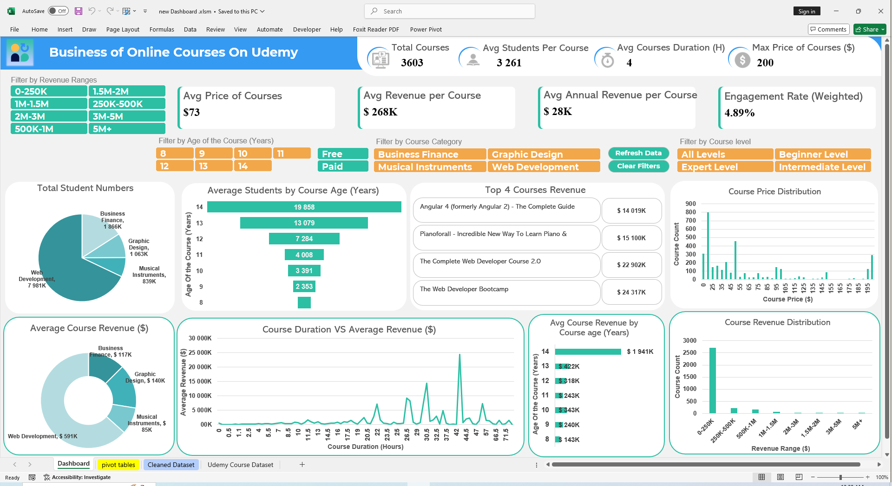

# Udemy Course Analytics Dashboard: The Ultimate Guide to Online Course Passive Income

<p align="center">
  
</p>

> **Can you really make passive income creating online courses?** 🤔  
> **Are online courses a valid long-term investment?** 💰  

If you've heard about making money from online courses on platforms like Udemy, this **data-driven interactive dashboard** will answer all your questions and show you exactly how to succeed in this market.

## 🎯 Key Questions This Dashboard Answers

**"What should I charge?"**  
**"Which category pays best?"**  
**"How many students do I need?"**  
**"What's the revenue potential?"**  
**"What's the best course duration for long-term passive income?"**

---

### Dataset Overview:
- **3,603 Courses** analyzed in total
- **Price Range:** $0 (free) to $200 (premium)
- **Course Age:** 8-14 years on Udemy platform
  - **Oldest courses:** Published in **2011**
  - **Newest courses:** Published in **2017**

### 🚀 Key Findings:
| Metric | Value | Insight |
|--------|--------|---------|
| **Average Revenue per Course** | $268K | Lifetime earning potential |
| **Average Annual Revenue** | $28K | Yearly passive income per course |
| **Average Students per Course** | 3,261 | Scale of successful courses |
| **Average Course Duration** | 4 hours | Optimal content length |
| **Max Course Price** | $200 | Premium pricing ceiling |

---

## 🔥 Most Shocking Discoveries

###**The Age Advantage**
- **14-year-old courses** earn **13x more** than 8-year courses
- **Mature courses (14 years):** $1.94M average lifetime revenue
- **Newer courses (8 years):** $143K average lifetime revenue

###**Category Winners**
1. **Business Finance:** $117K average revenue
2. **Web Development:** $591K average revenue  
3. **Graphic Design:** $140K average revenue

###**The Compound Effect**
Courses don't lose value over time—they **gain momentum**:
- **Year 8:** 19,858 average students per course
- **Year 14:** Exponentially more students and revenue

---

## 🎥 Video Demo


<p align="center">
  <a href="https://youtu.be/ZZA9vBl0Xl8">
    
  </a>
</p>

**🎬 [► Watch Full Video Demo](https://youtu.be/ZZA9vBl0Xl8)**
*Click to watch the full dashboard walkthrough*

---

## 🔍 Beginner Questions — Dashboard Solutions

### 1. **"Can I make money from one course?"**
**Answer:** YES! Average revenue per course is **$28K annually** (paid courses only, 4-hour average duration)
**Where to verify:** Check **Avg Revenue per Course** KPI and **Top Courses Revenue**

### 2. **"Do old courses still sell?"**
**Answer:** They sell BETTER! 14-year courses earn 13x more than 8-year courses
**Where to verify:** **"Avg Course Revenue by Course Age (Years)"** bar chart

### 3. **"How many students do I need?"**
**Answer:** Average successful courses have **3,261 students**
**Formula:** Revenue = Students × Price
**Where to verify:** **Avg Students per Course** KPI

### 4. **"Which topics sell best?"**
**Answer:** Business Finance and Web Development dominate
**Where to verify:** **Average Revenue by Category** and **Total Student Numbers** charts

### 5. **"How should I price my course?"**
**Answer:** **$73 average**, but can go up to **$200**
**Where to verify:** **Distribution of Course Price** and **Distribution of Revenue** charts

### 6. **"Does course length matter?"**
**Answer:**  YES! Longer courses = Higher revenue
**Where to verify:** **Duration vs Average Revenue** line chart and the Average Courses Duration Revenue metric 
at the top of the dashboard 

### you can explore those Answers yourself from the dashboard.
---

## 🛠️ Technical Details

### Data Preparation & Cleaning
- ✅ Extracted **course age** from creation dates for trend analysis
- ✅ Calculated **Revenue** = Students × Price
- ✅ Identified **inactive courses** (8+ years, zero enrollments)
- ✅ Created **revenue range bins** for advanced filtering
- ✅ Standardized metrics into **K** (thousands) and **M** (millions)

### Dashboard Features
- 🎛️ **Interactive Filters:** Revenue ranges, course age, categories, levels
- 📊 **8 Strategic Visualizations:** From KPIs to trend analyses
- 🔍 **Smart Filtering:** Free vs Paid course analysis
- 💡 **Business Intelligence:** Actionable insights for course creators

### ⚠️ Important Note
The **Free vs Paid Course** filter is **not connected** to paid-course KPIs, ensuring accurate metrics regardless of filter selection.

---

## 🎨 Dashboard Highlights

###**8 Powerful Visualizations:**
1. **KPI Overview:** Essential metrics at a glance
2. **Student Distribution by Category:** Market size analysis
3. **Average Students by Course Age:** Growth trends over time
4. **Top Revenue Courses:** Success stories and benchmarks
5. **Course Price Distribution:** Pricing landscape
6. **Average Course Revenue by Category:** Niche profitability
7. **Duration vs Revenue:** Content strategy insights
8. **Revenue Distribution by Ranges:** Market segments

### 🎯 **Strategic Filter System:**
- Revenue ranges (0-250K to 5M+)
- Course age (8-14 years)
- Categories (Business, Web Dev, Design, Music)
- Course levels (Beginner, Intermediate, Expert)
- Free vs Paid courses

---

## 💼 Business Impact

### For Aspiring Instructors:
- 🎯 **Niche Selection:** Data-driven category choices
- 💰 **Pricing Strategy:** Evidence-based pricing decisions  
- 📈 **Growth Planning:** Realistic revenue projections
- ⏰ **Timeline Expectations:** Long-term investment mindset

### For Current Instructors:
- 📊 **Portfolio Optimization:** Focus on high-revenue categories
- 🔍 **Market Positioning:** Understand competitive landscape
- 💡 **Content Strategy:** Optimal course length and structure
- 📈 **Revenue Forecasting:** Plan future course development

---

## ⏱️ Development Timeline

**Total Investment:** 14+ hours ON:
- 🧹 Data Cleaning: 
- 📊 KPI Development:  
- 🎨 Visualization Design
- 📖 Storytelling & Layout 
- 🔍 Business Analysis

---

## 🚀 Bottom Line

**If you have a passion for creating online courses, you CAN build sustainable passive income on Udemy.**

This dashboard helps you:
- ✅ Determine if your niche is profitable
- ✅ Set optimal pricing strategies
- ✅ Understand realistic timelines
- ✅ Make data-driven decisions

### 🔥 The Hottest Feature: **Revenue Analysis by Range Filters**
Use the advanced filtering system to drill down into specific revenue segments and discover hidden opportunities in the market.

---

## 📁 Repository Contents

```
├── dashboard-screenshot.png       # Main dashboard view
├── demo-video.mp4                # Interactive walkthrough
├── Online_Courses_Dashboard.xlsm           # Excel dashboard
├── README.md                     # This file

```

---

## 🤝 Connect & Collaborate

💡 **Questions about the analysis?**  
📊 **Want to explore your niche's potential?**  
🚀 **Ready to start your course creation journey?**

**Let's connect and turn data into income!**

---

## 📜 License & Usage

This dashboard and analysis are available for:
- ✅ Educational purposes
- ✅ Personal course planning  
- ✅ Business strategy development
- ✅ Market research

---

<p align="center">
  <strong>📈 Data-Driven Decisions Lead to Passive Income Success 💰</strong>
</p>

<p align="center">
  ⭐ <strong>Star this repo if it helped you understand the online course market!</strong> ⭐
</p>
